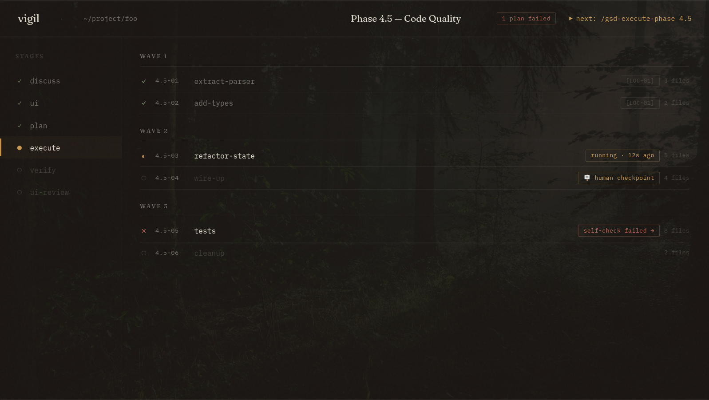
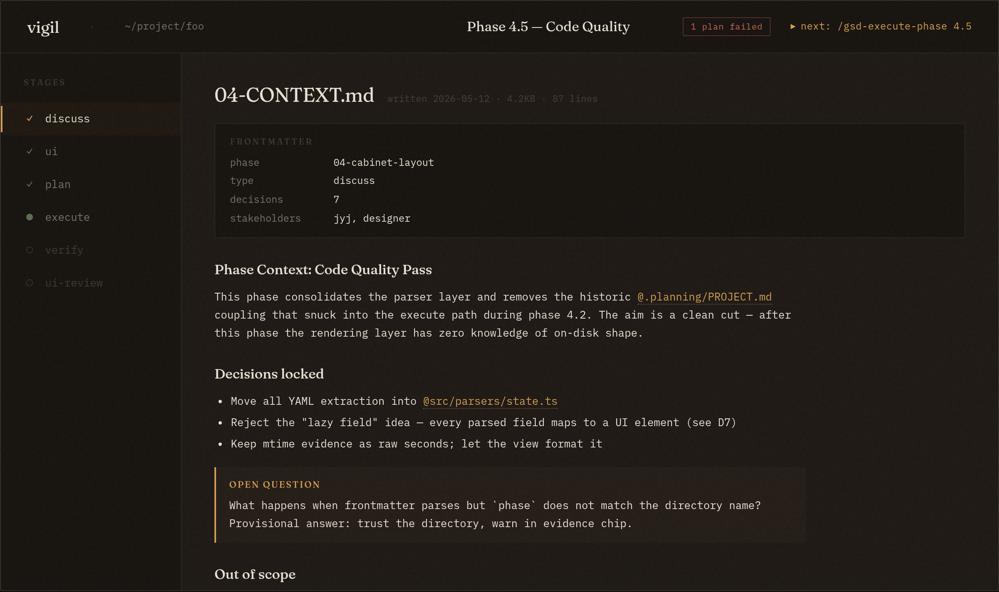
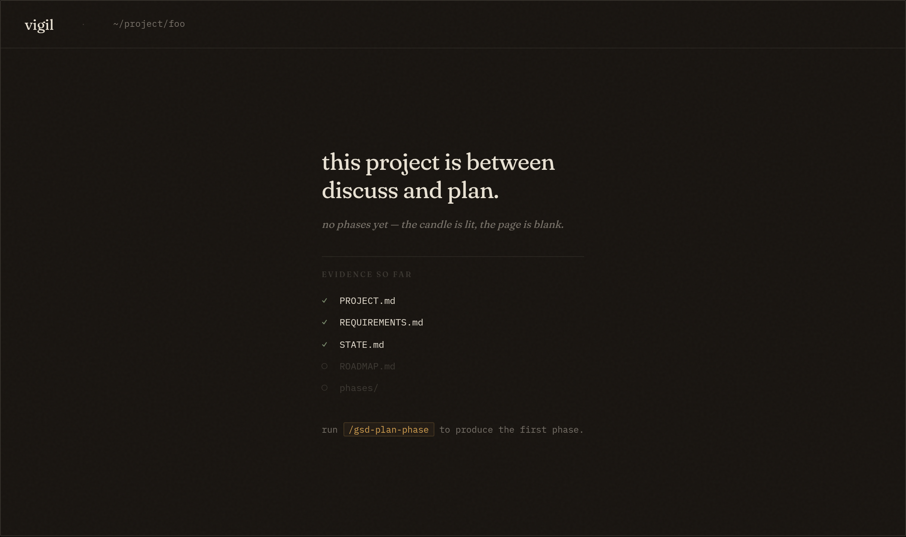

# vigil

A quiet, file-watched dashboard for [GSD][gsd]-style coding-agent
workflows that write durable state to a `.planning/` directory. Opens
in the morning and remembers — in about 30 seconds — where you left
off.

[gsd]: https://github.com/open-gsd/get-shit-done-redux

> Read-only. vigil never runs a workflow command, never spawns an
> agent, never edits a file. It watches and renders.

中文: [README.zh.md](README.zh.md)

---

## Screens


*Default — `execute` selected, plans grouped by wave.*


*A `discuss` artifact opened — middle column swaps to the drawer, left column stays.*


*Empty state — `.planning/` exists but `phases/` is empty.*

<!-- Mockups generated from research/swatches/layout.html via scripts/screenshot-swatches.mjs -->


## What it does

vigil watches a single `.planning/` directory — the on-disk format
maintained by [Get Shit Done (GSD)][gsd], a structured workflow that
breaks coding tasks into phases (`discuss` → `ui` → `plan` →
`execute` → `verify` → `ui-review`) with per-phase artifacts and
per-plan progress on disk — and renders one information-dense screen:

- **Top bar** — project path, current phase, recommended next action,
  and a recent-projects switcher.
- **Stages column** — the six GSD stages (`discuss` / `ui` / `plan` /
  `execute` / `verify` / `ui-review`) for the current phase, with the
  active one called out by a candle-amber accent. Multi-artifact
  stages (e.g. several `*-PLAN.md` files, or `CONTEXT` +
  `DISCUSSION-LOG` + `RESEARCH`) expand inline to a list of clickable
  sub-items.
- **Plans column** (when `execute` is selected) — plans grouped by
  wave, each row showing a glyph (`✓ ◐ ○ ✗`), the plan id, name, and
  evidence chips: running mtime, human-checkpoint flag, failure chip.
- **Artifact drawer** (when a non-execute stage's artifact is
  selected) — markdown rendered with GFM, frontmatter lifted into a
  structured card, GSD's custom XML tags (`<task>`, `<verify>`, …)
  rendered as callouts, `@file/path` references turned into clickable
  open-in-editor links. Long files are capped at 500 lines / 8000
  characters with a footer pointing at the editor.
- **Live updates** — file changes propagate over SSE; multiple browser
  tabs stay in sync; the connection auto-reconnects.
- **Empty states** — distinct screens for "no `.planning/` found",
  "freshly minted `.planning/`", and "partially malformed
  `.planning/`". No popups, no red errors at 9am.

The visual language is "Night-watch journal": warm dark ink
background, aged-paper foreground, a single amber accent for the one
thing burning right now, sage for completion, terracotta for failure.
No blue. No card shadows. No icon library.

## Install

> **Not yet on npm.** Publishing soon. For now, clone the repo and run
> from source — see [Develop](#develop).

```bash
# coming soon
npm install -g vigil
```

Requires Node ≥ 20.

## Run

```bash
vigil                       # auto-discover .planning/ upward from cwd
vigil ~/project/foo         # explicit path
```

Then open <http://localhost:7171>.

The CLI surface is exactly these two shapes — no subcommands, no flags
beyond `--help` / `--version`.

## Override the editor

By default, *open in editor* uses the `vscode://` URL scheme, which
also handles Cursor, Windsurf, Trae, and any VS Code fork. To use a
different editor, set:

```bash
export VIGIL_OPEN_URL="cursor://file/%s"
```

`%s` is the URL-encoded absolute path. A copy-path button sits next
to every open-in-editor link as a fallback.

## Recent projects

vigil remembers up to 8 recently-opened project paths in
`~/.config/vigil/recent.json`. Switch between them from the top-bar
dropdown. The file is path-only — no per-project preferences, no
window state, no telemetry.

## What it expects on disk

A `.planning/` directory laid out by a GSD-style workflow:

```
.planning/
├── STATE.md               # YAML frontmatter: active_phase, next_action, …
├── ROADMAP.md             # plan id → human-readable name
└── phases/
    └── 03-drug-lookup/
        ├── 03-CONTEXT.md         # discuss
        ├── 03-DISCUSSION-LOG.md  # discuss
        ├── 03-RESEARCH.md        # discuss
        ├── 03-UI-SPEC.md         # ui
        ├── 03-01-PLAN.md         # plan (per-plan)
        ├── 03-01-SUMMARY.md      # execute (per-plan)
        ├── 03-02-PLAN.md
        ├── 03-02-SUMMARY.md
        ├── 03-VERIFICATION.md    # verify
        └── 03-REVIEW.md          # ui-review
```

Background and rationale:
[`research/03-gsd-observations.md`](research/03-gsd-observations.md).
Product thesis: [`research/01-product-thesis.md`](research/01-product-thesis.md).

## Develop

```bash
npm install
npm run dev          # Hono server on :7171 + Vite client on :5173
npm run build        # Vite → dist/client, tsc → dist/server
npm start            # run the built server
npm run typecheck    # tsc on both server and client tsconfigs
npm run lint         # eslint --max-warnings=0
npx vitest run       # parsers + server tests
```

Architecture is enforced as a strict dependency DAG by
`eslint.config.js`:

- `src/types/` — leaf, no imports from server/client
- `src/parsers/` — pure, no `fs` / `node:*` / `chokidar` / server / client
- `src/server/` — Hono app, owns filesystem I/O
- `src/client/` — React 19 + Vite SPA

Decisions live under `research/` (`00-INDEX.md` indexes them). Read
those before changing parsing or UI semantics.

## Roadmap

vigil currently understands the [GSD][gsd] `.planning/` layout. The
parsers are pure and host-agnostic on purpose, so other coding-agent
workflows can be added as separate adapters without touching the
renderer.

Next on the list:

- **[Superpowers][superpowers]** — Claude Code skill collection by Jesse
  Vincent. Goal is to render its on-disk artifacts in the same Stages
  / Plans / Drawer layout once its file conventions stabilize.

[superpowers]: https://github.com/obra/superpowers

## License

MIT
